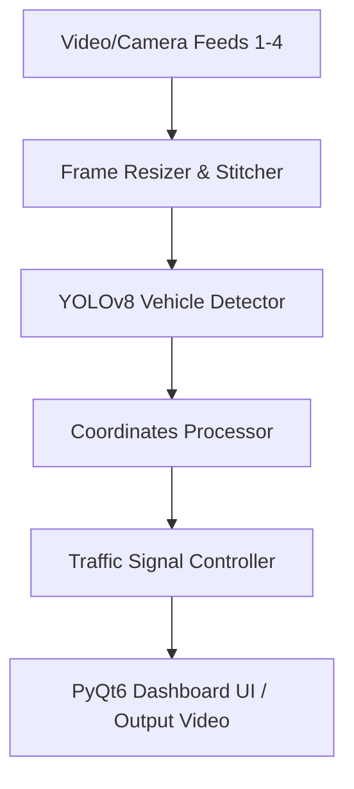

# 🚦 AI-Powered Smart Traffic Management System

[](https://www.python.org/)
[](https://www.riverbankcomputing.com/software/pyqt/)
[](https://github.com/ultralytics/ultralytics)
[](LICENSE)

An advanced, real-time AI Traffic Control System leveraging computer vision (YOLOv8) to dynamically adjust traffic light signals based on real-time lane density. The project features a premium, HUD-style PyQt6 Control Center dashboard that supports live feeds, system logging, dynamic layouts, and real-time zone/lane configuration.

---

## 🌟 Key Features

* **Real-Time Detection:** Employs YOLOv8 (specifically OpenImages V7 medium model weights) to detect cars, buses, trucks, motorcycles, and emergency vehicles.
* **Dynamic Traffic Light Timing:** Implements a density-responsive algorithm. Base green signal durations scale linearly based on the count of vehicles detected inside the respective lanes.
* **Auto-Scaling Layouts:** Automatically aligns the number of detection zones (up to a maximum of 4) to match active video sources, with layout-aware coordinate mapping (Full canvas, Split-screen, or Quadrants).
* **Emergency & VIP Priority:** Detects ambulances in real-time to immediately green-light the lane, with PyQt6 dashboard overrides for manual VIP or Emergency operations.
* **Premium PyQt6 GUI Center:**
  - **Signals Tab:** Live video stitching preview, signal status indicators, and manual controls.
  - **Density Stats Tab:** Embedded Matplotlib graphs displaying live bar charts of vehicle counts per lane.
  - **Zones Config Tab:** View coordinate bounds, edit active zone colors, names, and IDs, or create new zones. Changes are committed to configuration JSON files in real-time.
  - **Event Logs Tab:** Chronological logs of system overrides, signal changes, and detections.
* **Role-Based Access Control:** Secure SQLite user database with hashed credentials using `bcrypt` supporting roles such as "Traffic Officer" and "Project Developer".

---

## 🏗️ System Architecture



---

## 📁 Project Structure

```text
Smart-Traffic-Management-System/
├── assets/
│   ├── models/
│   │   └── yolov8m-oiv7.pt         # Pre-downloaded YOLOv8 weights
│   └── videos/
│       ├── demo_video_1.mp4        # Sample video feeds
│       └── ...
├── configs/
│   ├── default.json                # Default 4-quadrant layout
│   └── new_york.json               # 2-lane layout config
├── data/
│   ├── traffic_users.db            # SQLite database with credentials
│   └── zones.json                  # Fallback configurations
├── src/
│   ├── detector.py                 # YOLOv8 vehicle detection wrapper
│   ├── main.py                     # Headless/CLI entry point
│   ├── traffic_controller.py       # Light timing logic
│   ├── traffic_dashboard_pyqt.py   # PyQt6 GUI Application
│   ├── traffic_engine.py           # Threaded OpenCV execution pipeline
│   └── utils.py                    # Drawing and zone lookup utilities
├── requirements.txt                # Python dependencies
└── README.md                       # Documentation
```

---

## ⚙️ Installation & Setup

### 1. Prerequisites
Ensure you have Python 3.8 or newer installed on your machine.

### 2. Install Dependencies
Clone the repository, navigate into the project root, and install the required libraries:
```bash
pip install -r requirements.txt
```
> **Note:** Make sure you also have PyQt6, PyTorch, Matplotlib, and bcrypt installed:
> ```bash
> pip install PyQt6 torch matplotlib bcrypt
> ```

### 3. Verification of Assets
- Ensure the YOLO model weights are located in: `assets/models/yolov8m-oiv7.pt`.
- Ensure the demo videos are located in: `assets/videos/`.

---

## 🚀 Running the Application

### 1. Interactive Control Dashboard (GUI)
Run the PyQt6 center dashboard to monitor traffic, force signals, manage configuration zones, and view live graphs.
```bash
python src/traffic_dashboard_pyqt.py
```

#### Default Credentials:
| Username | Password | User Role |
| :--- | :--- | :--- |
| `admin` | `admin123` | Traffic Officer (Full access) |
| `developer` | `dev123` | Project Developer |

---

### 2. Headless / Command Line Interface (CLI)
You can run the core tracking engine in headless mode directly from the terminal to process video streams or record output files.
```bash
python src/main.py --location new_york --output test_output.mp4
```

#### Available CLI Arguments:
* `--location`: Name of the JSON config file under `configs/` to load (e.g., `default`, `new_york`). Default is `default`.
* `--sources`: Space-separated list of video source files or webcam indices (e.g., `--sources 0 1` or `--sources video.mp4`).
* `--output`: Path to save the processed output video (e.g., `output.mp4`).

---

## 🛠️ Customizing Detection Zones
1. Launch the **PyQt6 Dashboard**.
2. Click on the **Location** dropdown in the top right to choose the layout config you want to change.
3. Open the **Zones Config** tab.
4. Select a zone from the table to populate the form on the right.
5. Edit the name, coordinates bounds (format: `[[x1, y1], [x2, y2], ...]`), or RGB color list.
6. Click **Save Zone**. The live engine will immediately update to use the revised zone geometry.
